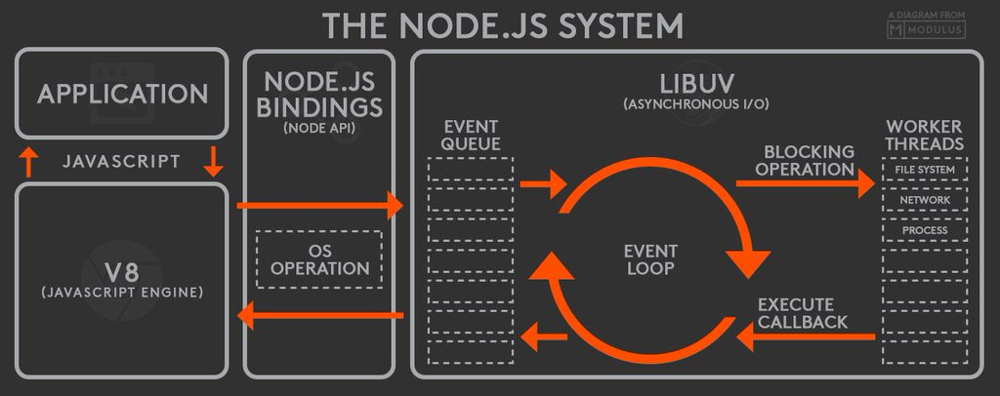

---

layout: default

---

# Яндекс

## **{{ site.presentation.title }}** {#cover}

    
{{ site.presentation.service }}





	
{{ site.author.name }},   {{ site.author.position }}

## &nbsp;
{:.section}

### Ресурсы компьютера

## Ресурсы компьютера

* ...CPU
* ...Оперативная память
* ...Диск
* ...Сеть

## Операции

* ...CPU bound
    * ...Вычисление числа Фибоначчи
    * ...Рендеринг изображений
    * ...Шаблонизация данных
* ...I/O bound
    * ...Подсчет количества строк в файле
    * ...Получение IP-адреса под домену
    * ...Запрос в базу данных

## Веб-приложения

| Действие                  | Тип операции |
+---------------------------|--------------+
| Чтение HTTP-запроса       |              |
|---------------------------|--------------|

## Веб-приложения

| Действие                  | Тип операции |
+---------------------------|--------------+
| Чтение HTTP-запроса       | I/O          |
|---------------------------|--------------|

## Веб-приложения

| Действие                  | Тип операции |
+---------------------------|--------------+
| Чтение HTTP-запроса       | I/O          |
|---------------------------|--------------|
| Парсинг HTTP-запроса      |              |
|---------------------------|--------------|

## Веб-приложения

| Действие                  | Тип операции |
+---------------------------|--------------+
| Чтение HTTP-запроса       | I/O          |
|---------------------------|--------------|
| Парсинг HTTP-запроса      | CPU          |
|---------------------------|--------------|

## Веб-приложения

| Действие                  | Тип операции |
+---------------------------|--------------+
| Чтение HTTP-запроса       | I/O          |
|---------------------------|--------------|
| Парсинг HTTP-запроса      | CPU          |
|---------------------------|--------------|
| Запрос в базу данных      |              |
|---------------------------|--------------|

## Веб-приложения

| Действие                  | Тип операции |
+---------------------------|--------------+
| Чтение HTTP-запроса       | I/O          |
|---------------------------|--------------|
| Парсинг HTTP-запроса      | CPU          |
|---------------------------|--------------|
| Запрос в базу данных      | I/O          |
|---------------------------|--------------|

## Веб-приложения

| Действие                  | Тип операции |
+---------------------------|--------------+
| Чтение HTTP-запроса       | I/O          |
|---------------------------|--------------|
| Парсинг HTTP-запроса      | CPU          |
|---------------------------|--------------|
| Запрос в базу данных      | I/O          |
|---------------------------|--------------|
| Запрос во внешние сервисы |              |
|---------------------------|--------------|

## Веб-приложения

| Действие                  | Тип операции |
+---------------------------|--------------+
| Чтение HTTP-запроса       | I/O          |
|---------------------------|--------------|
| Парсинг HTTP-запроса      | CPU          |
|---------------------------|--------------|
| Запрос в базу данных      | I/O          |
|---------------------------|--------------|
| Запрос во внешние сервисы | I/O          |
|---------------------------|--------------|

## Веб-приложения

| Действие                  | Тип операции |
+---------------------------|--------------+
| Чтение HTTP-запроса       | I/O          |
|---------------------------|--------------|
| Парсинг HTTP-запроса      | CPU          |
|---------------------------|--------------|
| Запрос в базу данных      | I/O          |
|---------------------------|--------------|
| Запрос во внешние сервисы | I/O          |
|---------------------------|--------------|
| Генерация разметки        |              |
|---------------------------|--------------|

## Веб-приложения

| Действие                  | Тип операции |
+---------------------------|--------------+
| Чтение HTTP-запроса       | I/O          |
|---------------------------|--------------|
| Парсинг HTTP-запроса      | CPU          |
|---------------------------|--------------|
| Запрос в базу данных      | I/O          |
|---------------------------|--------------|
| Запрос во внешние сервисы | I/O          |
|---------------------------|--------------|
| Генерация разметки        | CPU          |
|---------------------------|--------------|

## Веб-приложения

| Действие                  | Тип операции |
+---------------------------|--------------+
| Чтение HTTP-запроса       | I/O          |
|---------------------------|--------------|
| Парсинг HTTP-запроса      | CPU          |
|---------------------------|--------------|
| Запрос в базу данных      | I/O          |
|---------------------------|--------------|
| Запрос во внешние сервисы | I/O          |
|---------------------------|--------------|
| Генерация разметки        | CPU          |
|---------------------------|--------------|
| Отправка ответа           |              |
+---------------------------|--------------+

## Веб-приложения

| Действие                  | Тип операции |
+---------------------------|--------------+
| Чтение HTTP-запроса       | I/O          |
|---------------------------|--------------|
| Парсинг HTTP-запроса      | CPU          |
|---------------------------|--------------|
| Запрос в базу данных      | I/O          |
|---------------------------|--------------|
| Запрос во внешние сервисы | I/O          |
|---------------------------|--------------|
| Генерация разметки        | CPU          |
|---------------------------|--------------|
| Отправка ответа           | I/O          |
+---------------------------|--------------+

## &nbsp;
{:.section}

### Как быть?

## Как быть?

* Многопоточность
  * ...Переключение контекста не бесплатное
  * ...При росте количества растут накладные расходы
  * ...Управление общими ресурсами
  * ...Состояние гонки

## Как быть?

* Очередь событий
  * ...Приложение запрашивает ресурс в неблокирущем режиме
  * ...Приложение продолжает работу
  * ...При готовности ресурса ОС оповестит приложение

## &nbsp;
{:.section}

### Что такое Node.js?

## Платформа для разработки приложений

* libuv
    * Неблокирующий I/O
    * Кроссплатформенность
* Корневая библиотека
    * Множество модулей для взаимодействия с ОС

## Что такое Node.js?

[https://twitter.com/BusyRich/status/494959181871316992](https://twitter.com/BusyRich/status/494959181871316992)

## Что такое Node.js?

Threads? WTF?

## Что такое Node.js?

Threads? [http://nikhilm.github.io/uvbook/threads](http://nikhilm.github.io/uvbook/threads)

## Среда выполнения JavaScript

* Интерпретатор V8
    * ...Just In Time компиляция в машинный код
    * ...Оптимизации в рантайме
    * ...Эффективная сборка мусора

## JavaScript

* Создан в пользовательских интерфейсах
* Готов к Event Loop
* Функции первого класса и замыкания

## Блокирующий ввод/вывод

~~~javascript
var fs = require('fs');

console.log('A');

var content = fs.readFileSync('file.txt');

console.log('B', content);
~~~

## Неблокирующий ввод/вывод

~~~ javascript
var fs = require('fs');

console.log('A');

fs.readFile('file.txt', function (error, content) {
    if (error) {
        return console.error(error);
    }

    console.log('C', content);
});

console.log('B');
~~~

## &nbsp;
{:.section}

### Механизмы работы с асинхронными вызовами

## Callback

~~~ javascript
function callback(error, content) {
    if (error) {
        return console.error(error);
    }

    console.log(content);
}

var fs = require('fs');

fs.readFile('file.txt', callback);
~~~

## Promise

~~~ javascript
function getFilePromise(filename) {
    return new Promise(function (resolve, reject) {
        fs.readFile(filename, function (error, content) {
            if (error) {
                return reject(error);
            }

            resolve(content);
        });
    });
}
~~~

## Используем Promise

~~~ javascript
getFilePromise('file.txt')
    .then(function (content) {
        console.log('File content:', content);
    })
    .catch(function (error) {
        console.error(error);
    });
~~~

## Два вызова без Promise

~~~ javascript
fs.readFile('file.txt', function (error, content) {
    if (error) {
        return console.error(error);
    }

    console.log('First file content:', content);

    fs.readFile('file1.txt', function (error, content) {
        if (error) {
            return console.error(error);
        }

        console.log('Second file content:', content);
    });
});
~~~

## Два вызова с Promise

~~~ javascript
getFilePromise('file.txt')
    .then(function (content) {
        console.log('First file content:', content);

        return getFilePromise('file1.txt');
    })
    .then(function (content) {
        console.log('Second file content:', content);
    })
    .catch(function (error) {
        console.error(error);
    })
    .then(function () {
        console.log('End');
    });
~~~

## Параллельные вызовы с Promise

~~~ javascript
var filenames = [
    'file.txt',
    'file1.txt',
    ...,
    'fileN.txt'
];

var promises = filenames.map(function (filename) {
    return getFilePromise(filename);
});

Promise.all(promises)
    .then(function (filesContent) {
        console.log('Files content:', filesContent);
    })
    .catch(function (error) {
        console.error(error);
    });
~~~

## &nbsp;
{:.section}

### CommonJS модули

## Экспорт и импорт

Экспорт

~~~ javascript
// square.js

module.exports = function square(x) {
    return x * x;
};
~~~

Импорт

~~~ javascript
// app.js

var square = require('./square');

console.log(square(2));
~~~

## Экспорт и импорт

Экспорт

~~~ javascript
// math.js

exports.square = function square(x) {
    return x * x;
};
~~~

Импорт

~~~ javascript
// app.js

var square = require('./math').square;

console.log(square(2));
~~~

## Как работает require?

* Встроенные

~~~ javascript
var http = require('http');

var net = require('net');

var zlib = require('zlib');
~~~

## Как работает require?

* Установленные

~~~ javascript
var lodash = require('lodash');

var request = require('request');
~~~

~~~
/home/user/app/node_modules
/home/user/node_modules
/home/node_modules
/node_modules
~~~

## Как работает require?

* Локальные

~~~ javascript
// ./utils/math.js
var math = require('./utils/math');

// ./server/index.js
var server = require('./server');
~~~

[https://nodejs.org/api/modules.html#modules_all_together](https://nodejs.org/api/modules.html#modules_all_together)

## &nbsp;
{:.section}

### Buffer

## Buffer

~~~ javascript
var buffer = new Buffer(255);

buffer[0] = 23;

fs.readFile('file.txt', function (error, buffer) {
    Buffer.isBuffer(buffer); // true

    console.log(buffer); // <Buffer 68 65 6c 6c 6f>

    buffer.toString('utf-8'); // 'hello'

    buffer.toString('base64'); // 'aGVsbG8='
});
~~~

[https://nodejs.org/api/buffer.html](https://nodejs.org/api/buffer.html)

## &nbsp;
{:.section}

### EventEmitter

## EventEmitter

~~~ javascript
var EventEmitter = require('events').EventEmitter;

var emitter = new EventEmitter();

emitter.on('event', function (data) { console.log(data) });

emitter.emit('event', {hello: 'world'});

emitter.removeAllListeners('event');
~~~

[https://nodejs.org/api/events.html#events_class_eventemitter](https://nodejs.org/api/events.html#events_class_eventemitter)

## &nbsp;
{:.section}

### Stream

## Stream

## Stream

## Stream

## Stream

## Stream

## Stream

## Stream

## Stream

## Stream

* Readable
* Writable
* Duplex
* Transform

[https://nodejs.org/api/stream.html](https://nodejs.org/api/stream.html)

## Чтение из файла

~~~ javascript
try {
    var content = fs.readFileSync('file.txt');

    console.log(content);
} catch (error) {
    console.error(error);
}
~~~

## Чтение из файла

~~~ javascript
fs.readFile('file.txt', function (error, content) {
    if (error) {
        return console.error(error);
    }

    console.log(content);
});
~~~

## Чтение из файла

~~~ javascript
var stream = fs.createReadStream('file.txt');

stream.on('data', function (chunk) {
    console.log(chunk);
});

stream.on('error', function (error) {
    console.error(error);
});

stream._read(0xff);
~~~

## Чтение из файла

~~~javascript
var stream = fs.createReadStream('file.txt');

stream.pipe(process.stdout);
~~~

## Веб-приложение

~~~ javascript
var http = require('http');

var server = http.createServer(function (request, response) {

    // ...

});

server.listen(4000);
~~~

## Веб-приложение

~~~ javascript
var http = require('http');
var fs = require('fs');

var server = http.createServer(function (request, response) {
    fs.readFile('file.txt', function (error, content) {

        // ...

    });
});

server.listen(4000);
~~~

## Веб-приложение

~~~ javascript
var http = require('http');
var fs = require('fs');

var server = http.createServer(function (request, response) {
    fs.readFile('file.txt', function (error, content) {
        if (error) {
            return _handleError(response);
        }

        response.end(content);
    });
});

server.listen(4000);
~~~

## Веб-приложение

~~~ javascript
var http = require('http');
var fs = require('fs');

var server = http.createServer(function (request, response) {
    var stream = fs.createReadStream('file.txt');

    stream.on('error', _handleError(response));

    stream.pipe(response);
});

server.listen(4000);
~~~

## Веб-приложение

~~~ javascript
var http = require('http');
var fs = require('fs');
var zlib = require('zlib');

var server = http.createServer(function (request, response) {
    var stream = fs.createReadStream('file.txt');

    stream.on('error', _handleError(response));

    stream
        .pipe(zlib.createGzip())
        .pipe(response);
});

server.listen(4000);
~~~

## RTFM

[https://nodejs.org/api/](https://nodejs.org/api/)

## **Контакты** {#contacts}

{{ site.author.name }}

{{ site.author.position }}

    

        <!-- 
+7 (000) 000-00-00
 -->
        
alex-vee@yandex-team.ru

        
@verkholantsev

        <!-- 
vk
 -->
        
verkholantsev

    

